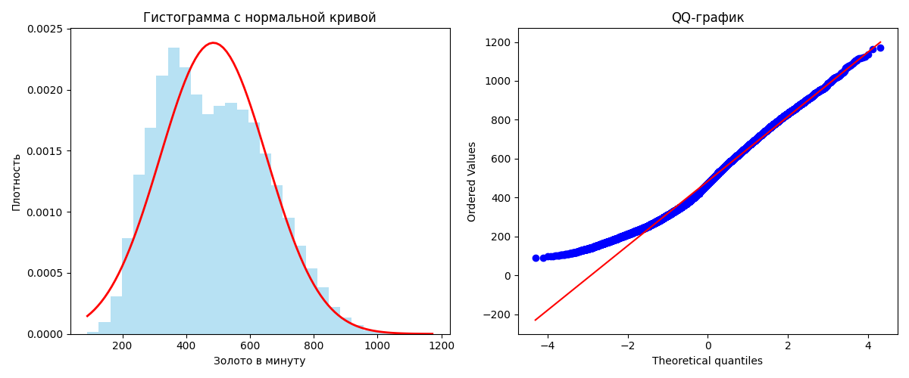

## Описание датасета

Датасет содержит данные о профессиональных матчах Dota 2, собранные в рамках лиг Pro League с 2016 по 2025 год. Он включает подробную статистику игроков, информацию о действиях в игре, предметах, героях и результатах матчей. Основная цель — анализ игровых данных для прогнозирования исходов матчей, оценки производительности игроков и других задач, связанных с анализом игр.

Хотелось выложить датасет, но он слишком большой. (лучше скачать с кагла.) В работе использовались только данные за 2025 год, так как больше не влезало в мою оперативную память.

## Структура данных

Датасет содержит 151 признак, описывающих различные аспекты игрового процесса. Ниже приведена таблица с описанием каждого признака, его назначением и, где применимо, единицами измерения.

| Признак                     | Описание                                                                 | Единицы измерения     |
|-----------------------------|--------------------------------------------------------------------------|-----------------------|
| `player_slot`               | Слот игрока в команде (0-4 для Radiant, 128-132 для Dire)                | -                     |
| `obs_placed`                | Количество установленных Observer Wards (видения)                        | шт.                   |
| `sen_placed`                | Количество установленных Sentry Wards (обнаружения невидимости)          | шт.                   |
| `creeps_stacked`            | Количество стакнутых крипов (накопленных в лагере)                       | шт.                   |
| `camps_stacked`             | Количество стакнутых лагерей крипов                                      | шт.                   |
| `rune_pickups`              | Количество поднятых рун (баффов)                                         | шт.                   |
| `firstblood_claimed`        | Участие в первом убийстве (First Blood)                                  | 0 или 1               |
| `teamfight_participation`   | Доля участия в командных сражениях                                       | доля (0-1)            |
| `towers_killed`             | Количество уничтоженных башен                                            | шт.                   |
| `roshans_killed`            | Количество убитых Рошанов                                                | шт.                   |
| `observers_placed`          | Количество установленных Observer Wards (возможно, дублирует `obs_placed`) | шт.               |
| `stuns`                     | Общее время оглушения, нанесённого врагам                                | секунды               |
| `max_hero_hit`              | Максимальный урон, нанесённый одному герою за раз                        | единицы урона         |
| `times`                     | Временные метки событий (возможно, список)                               | секунды               |
| `gold_t`                    | Золото, заработанное к определённому времени (список)                    | золото                |
| `lh_t`                      | Количество добитых крипов (last hits) к определённому времени (список)   | шт.                   |
| `dn_t`                      | Количество отказов (denies) к определённому времени (список)             | шт.                   |
| `xp_t`                      | Опыт, полученный к определённому времени (список)                        | опыт                  |
| `obs_log`                   | Лог установки Observer Wards                                             | -                     |
| `sen_log`                   | Лог установки Sentry Wards                                               | -                     |
| `obs_left_log`              | Лог оставшихся Observer Wards                                            | -                     |
| `sen_left_log`              | Лог оставшихся Sentry Wards                                              | -                     |
| `purchase_log`              | Лог покупок предметов                                                    | -                     |
| `kills_log`                 | Лог убийств                                                              | -                     |
| `buyback_log`               | Лог выкупов (buybacks)                                                   | -                     |
| `runes_log`                 | Лог поднятых рун                                                         | -                     |
| `connection_log`            | Лог подключений/отключений                                               | -                     |
| `lane_pos`                  | Позиция на линии (возможно, координаты)                                  | -                     |
| `obs`                       | Информация об Observer Wards (возможно, позиции)                         | -                     |
| `sen`                       | Информация о Sentry Wards (возможно, позиции)                            | -                     |
| `actions`                   | Действия игрока (возможно, список команд)                                | -                     |
| `pings`                     | Количество пингов (сигналов)                                             | шт.                   |
| `purchase`                  | Информация о покупках (возможно, список предметов)                       | -                     |
| `gold_reasons`              | Причины получения золота (список)                                        | -                     |
| `xp_reasons`                | Причины получения опыта (список)                                         | -                     |
| `killed`                    | Информация об убийствах (кого убил)                                      | -                     |
| `item_uses`                 | Использование предметов (список)                                         | -                     |
| `ability_uses`              | Использование способностей (список)                                      | -                     |
| `ability_targets`           | Цели способностей (список)                                               | -                     |
| `damage_targets`            | Цели урона (список)                                                      | -                     |
| `hero_hits`                 | Количество ударов по героям                                              | шт.                   |
| `damage`                    | Общий урон, нанесённый                                                   | единицы урона         |
| `damage_taken`              | Общий урон, полученный                                                   | единицы урона         |
| `damage_inflictor`          | Источники урона (список)                                                 | -                     |
| `runes`                     | Информация о рунах (возможно, типы)                                      | -                     |
| `killed_by`                 | Кем был убит (список)                                                    | -                     |
| `kill_streaks`              | Серии убийств (список)                                                   | -                     |
| `multi_kills`               | Множественные убийства (список)                                          | -                     |
| `life_state`                | Состояние жизни (жив/мёртв/возрождён)                                    | -                     |
| `healing`                   | Общее исцеление, предоставленное                                         | единицы здоровья      |
| `damage_inflictor_received` | Источники полученного урона (список)                                     | -                     |
| `randomed`                  | Был ли герой выбран случайным образом                                    | 0 или 1               |
| `pred_vict`                 | Предсказанная победа (возможно, для ставок)                              | -                     |
| `party_id`                  | Идентификатор группы (если игроки в одной группе)                        | -                     |
| `permanent_buffs`           | Постоянные баффы (список)                                                | -                     |
| `party_size`                | Размер группы                                                            | человек               |
| `account_id`                | Идентификатор аккаунта игрока                                            | -                     |
| `team_number`               | Номер команды (0 для Radiant, 1 для Dire)                                | -                     |
| `team_slot`                 | Слот в команде (0-4)                                                     | -                     |
| `hero_id`                   | Идентификатор героя                                                      | -                     |
| `item_0` - `item_5`         | Предметы в инвентаре (0-5)                                               | -                     |
| `backpack_0` - `backpack_2` | Предметы в рюкзаке (0-2)                                                | -                     |
| `item_neutral`              | Нейтральный предмет                                                      | -                     |
| `kills`                     | Количество убийств                                                       | шт.                   |
| `deaths`                    | Количество смертей                                                       | шт.                   |
| `assists`                   | Количество помощей                                                       | шт.                   |
| `leaver_status`             | Статус выхода из игры (0 - завершил матч, 1 - покинул)                   | -                     |
| `last_hits`                 | Количество добитых крипов                                                | шт.                   |
| `denies`                    | Количество отказов (denies)                                              | шт.                   |
| `gold_per_min`              | Золото в минуту                                                          | золото/мин            |
| `xp_per_min`                | Опыт в минуту                                                            | опыт/мин              |
| `level`                     | Уровень героя к концу матча                                              | -                     |
| `net_worth`                 | Чистая стоимость (общее золото)                                          | золото                |
| `aghanims_scepter`          | Наличие Aghanim's Scepter                                                | 0 или 1               |
| `aghanims_shard`            | Наличие Aghanim's Shard                                                  | 0 или 1               |
| `moonshard`                 | Наличие Moon Shard                                                       | 0 или 1               |
| `hero_damage`               | Урон, нанесённый героям                                                  | единицы урона         |
| `tower_damage`              | Урон, нанесённый башням                                                  | единицы урона         |
| `hero_healing`              | Исцеление, предоставленное героям                                        | единицы здоровья      |
| `gold`                      | Общее золото, заработанное                                               | золото                |
| `gold_spent`                | Общее золото, потраченное                                                | золото                |
| `ability_upgrades_arr`      | Порядок улучшения способностей (список)                                  | -                     |
| `personaname`               | Никнейм игрока                                                           | -                     |
| `name`                      | Имя игрока (возможно, настоящее)                                         | -                     |
| `last_login`                | Дата последнего входа                                                    | -                     |
| `radiant_win`               | Победа команды Radiant                                                   | True/False            |
| `start_time`                | Время начала матча                                                       | timestamp             |
| `duration`                  | Длительность матча                                                       | секунды               |
| `cluster`                   | Кластер сервера                                                          | -                     |
| `lobby_type`                | Тип лобби (например, ranked, casual)                                     | -                     |
| `game_mode`                 | Режим игры (например, All Pick, Captains Mode)                           | -                     |
| `is_contributor`            | Является ли игрок участником (возможно, для разработчиков)               | 0 или 1               |
| `patch`                     | Версия патча игры                                                        | -                     |
| `region`                    | Регион сервера                                                           | -                     |
| `isRadiant`                 | Принадлежность к команде Radiant                                         | True/False            |
| `win`                       | Победа игрока (1 - победа, 0 - поражение)                                | 0 или 1               |
| `lose`                      | Поражение игрока (1 - поражение, 0 - победа)                             | 0 или 1               |
| `total_gold`                | Общее золото, заработанное за матч                                       | золото                |
| `total_xp`                  | Общий опыт, полученный за матч                                           | опыт                  |
| `kills_per_min`             | Убийства в минуту                                                        | шт./мин               |
| `kda`                       | Соотношение убийств/смертей/помощи (KDA)                                 | -                     |
| `abandons`                  | Количество покинутых матчей                                              | шт.                   |
| `neutral_kills`             | Количество убитых нейтральных крипов                                     | шт.                   |
| `tower_kills`               | Количество уничтоженных башен (возможно, дублирует `towers_killed`)      | шт.                   |
| `courier_kills`             | Количество убитых курьеров                                               | шт.                   |
| `lane_kills`                | Количество убитых крипов на линии                                        | шт.                   |
| `hero_kills`                | Количество убитых героев (возможно, дублирует `kills`)                   | шт.                   |
| `observer_kills`            | Количество уничтоженных Observer Wards                                   | шт.                   |
| `sentry_kills`              | Количество уничтоженных Sentry Wards                                     | шт.                   |
| `roshan_kills`              | Количество убитых Рошанов (возможно, дублирует `roshans_killed`)         | шт.                   |
| `necronomicon_kills`        | Количество убитых существ из Necronomicon                                | шт.                   |
| `ancient_kills`             | Количество убитых древних крипов                                         | шт.                   |
| `buyback_count`             | Количество выкупов (buybacks)                                            | шт.                   |
| `observer_uses`             | Количество использований Observer Wards                                  | шт.                   |
| `sentry_uses`               | Количество использований Sentry Wards                                    | шт.                   |
| `lane_efficiency`           | Эффективность на линии (доля золота/опыта)                               | доля (0-1)            |
| `lane_efficiency_pct`       | Эффективность на линии в процентах                                       | %                     |
| `lane`                      | Линия, на которой играл игрок (1-3)                                      | -                     |
| `lane_role`                 | Роль на линии (1-5, например, safe lane, mid, offlane)                   | -                     |
| `is_roaming`                | Был ли игрок в роуминге                                                  | 0 или 1               |
| `purchase_time`             | Время покупки предметов (список)                                         | секунды               |
| `first_purchase_time`       | Время первой покупки                                                     | секунды               |
| `item_win`                  | Победа с определённым предметом (возможно, для анализа)                  | -                     |
| `item_usage`                | Использование предметов (список)                                         | -                     |
| `purchase_tpscroll`         | Количество купленных Town Portal Scrolls                                 | шт.                   |
| `actions_per_min`           | Действия в минуту                                                        | шт./мин               |
| `life_state_dead`           | Время, проведённое мёртвым                                               | секунды               |
| `rank_tier`                 | Ранг игрока (например, Herald, Guardian)                                 | -                     |
| `is_subscriber`             | Является ли игрок подписчиком (например, Dota Plus)                      | 0 или 1               |
| `cosmetics`                 | Косметические предметы (список)                                          | -                     |
| `benchmarks`                | Сравнительные показатели (возможно, для анализа производительности)      | -                     |
| `purchase_ward_observer`    | Количество купленных Observer Wards                                      | шт.                   |
| `purchase_ward_sentry`      | Количество купленных Sentry Wards                                        | шт.                   |
| `purchase_gem`              | Количество купленных Gem of True Sight                                   | шт.                   |
| `purchase_rapier`           | Количество купленных Divine Rapier                                       | шт.                   |
| `match_id`                  | Идентификатор матча                                                      | -                     |
| `leagueid`                  | Идентификатор лиги                                                       | -                     |
| `performance_others`        | Другие показатели производительности (возможно, для анализа)             | -                     |
| `additional_units`          | Дополнительные юниты (например, иллюзии)                                 | -                     |
| `repicked`                  | Был ли герой перевыбран                                                  | 0 или 1               |
| `hero_variant`              | Вариант героя (например, для героев с несколькими формами)               | -                     |
| `neutral_tokens_log`        | Лог нейтральных токенов (возможно, для предметов)                        | -                     |
| `neutral_item_history`      | История нейтральных предметов (список)                                   | -                     |
| `item_neutral2`             | Второй нейтральный предмет (если есть)                                   | -                     |

Результат выполнения лабораторной.

## Задание 3.

## Задание 4.

## Задание 5.

## Задание 6.

## Задание 7.

